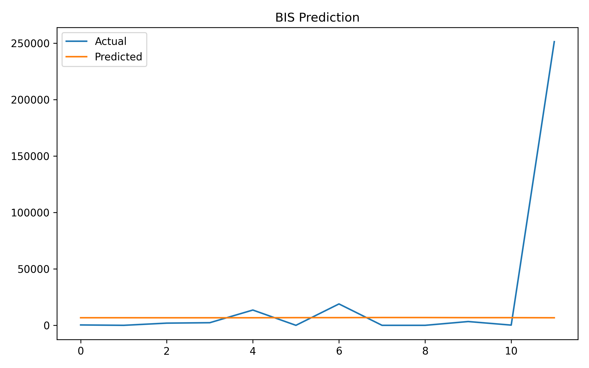

🐟 AI-Driven Fish Market Supply Forecasting.
Hybrid BA–AIS Optimized LSTM Model (BIS)
📌 Project Overview

Fish markets often face high price volatility due to uncertain fish supply, influenced by weather conditions, seasonal variations, and fishing regulations.
This project proposes an AI-driven supply forecasting system using a hybrid meta-heuristic optimization approach combining the Bat Algorithm (BA) and Artificial Immune System (AIS) with an LSTM neural network.

The model accurately predicts future fish supply trends, enabling fisher cooperatives, traders, and policymakers to make informed decisions.

🎯 Objectives

Forecast short-term fish supply using historical data

Reduce uncertainty in fish market operations

Optimize LSTM hyperparameters using a hybrid BA + AIS approach

Provide interpretable visual results and metrics

🧠 Methodology
🔹 Hybrid Optimization Strategy (BIS)
Component	Role
Bat Algorithm (BA)	Global exploration of hyperparameter space
Artificial Immune System (AIS)	Local refinement and mutation
LSTM	Temporal sequence learning
🔹 Optimized Hyperparameters

Time window size

Number of LSTM units

Learning rate

📊 Dataset

Input File

Table_A-5.1.csv

Features Used

Historical fish supply values (time series)

The pipeline automatically detects the primary numerical supply column.

🏗️ Project Structure
Fish Market Supply Forecasting/
│
├── Table_A-5.1.csv
├── bis_model.h5
├── bis_scaler.pkl
├── bis_config.yaml
├── bis_metrics.json
├── bis_results.csv
├── bis_predictions.csv
│
├── bis_accuracy_graph.png
├── bis_prediction_graph.png
├── bis_result_graph.png
├── bis_error_graph.png
│
└── README.md

📈 Outputs Generated
📁 Model & Configuration
File	Description
bis_model.h5	Trained LSTM model
bis_scaler.pkl	MinMaxScaler
bis_config.yaml	Optimized parameters
bis_metrics.json	MAE & RMSE metrics
📁 Predictions
File	Description
bis_results.csv	Actual vs Predicted
bis_predictions.csv	Future supply forecast
📁 Visualizations
Graph	Description
bis_accuracy_graph.png	Training & validation loss
bis_prediction_graph.png	Actual vs predicted supply
bis_result_graph.png	Prediction scatter
bis_error_graph.png	Residual error trend
📉 Evaluation Metrics

Mean Absolute Error (MAE)

Root Mean Squared Error (RMSE)

Train–Test performance comparison

All metrics are automatically saved in bis_metrics.json.

▶️ How to Run
1️⃣ Install Dependencies
pip install numpy pandas matplotlib scikit-learn tensorflow pyyaml

2️⃣ Run the Pipeline
python bis_fish_supply_forecasting.py

All outputs will be generated automatically in the project folder.

💡 Use-Cases

🐟 Fisher cooperatives planning daily supply

🏪 Wholesale fish markets

📈 Price volatility mitigation

🏛️ Fisheries policy analysis

🚀 Advantages of BIS Model

Hybrid optimization improves convergence

Robust against local minima

Works well with limited datasets

Highly interpretable results

🔮 Future Enhancements

Integrate weather & oceanographic data

Add price prediction module

Multi-species forecasting

Web dashboard deployment

Real-time IoT sensor integration

📚 Academic Relevance

This project is suitable for:

Final year B.Tech / M.Tech projects

Research publications (Hybrid Meta-Heuristic Optimization)

IEEE / Springer conference submissions

👤 Author

Sagnik Patra
AI & Machine Learning Researcher
